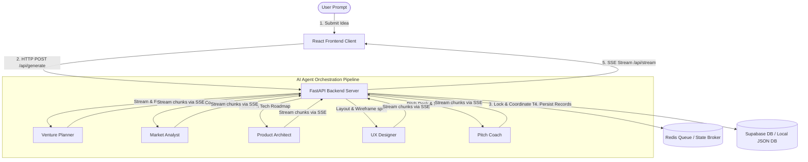

# VentureOS — Multi-Agent Venture Incubation Canvas

VentureOS is an advanced, production-ready workspace that automatically designs, codes, analyzes, and evaluates complete startup packages from a single elevator pitch. By orchestrating a pipeline of five specialized AI agents, it generates full-scale startup blueprints including venture specs, market studies, product roadmaps, UX wireframes, interactive UI sandbox prototypes, and pitch evaluator logs.

---

## 🏗️ System Architecture

The following diagram illustrates the flow of information between the React client, FastAPI server, Redis task state broker, and the specialized AI agents:



---

## 🚀 Key Features

*   **Multi-Agent Pipeline**: Automatically orchestrates a linear pipeline of 5 specialized agents:
    *   **Venture Planner** (Strategy Lead)
    *   **Market Analyst** (Market Intelligence)
    *   **Product Architect** (Roadmap Lead)
    *   **UX Designer** (UI/UX Spec)
    *   **Pitch Coach** (Deck & Evaluation Pitch Simulator)
*   **Interactive UX Sandbox**: Tailors a live mock-up interface based on the startup's category (SaaS Dashboard, Developer Console, Product Marketplace, or Consumer Mobile App) with device toggles (Desktop/Mobile).
*   **D3 Data Visualizations**: Renders dynamic interactive charts directly in the browser:
    *   **Venture Viability Radar**: Evaluates holistic scores across product, market, strategy, tech, and finance.
    *   **Market Sizing (TAM/SAM/SOM)**: Evaluates addressable markets.
*   **Offline PDF Exporter**: A self-contained dynamic PDF exporter using `html2pdf.js` that compiles the entire venture documentation package and downloads it as a print-ready report.
*   **Flexible Database Modes**: Supports dual modes:
    *   **Production**: Connected to Supabase with full Row-Level Security (RLS) policies.
    *   **Demo / Sandbox**: Fully functional offline mode using a local JSON database.

---

## 🛠️ Technology Stack

*   **Backend**: FastAPI, Uvicorn, Pydantic, Redis, Supabase Python Client, HTTPX.
*   **Frontend**: React (v19), TypeScript, Vite, Tailwind CSS, Lucide Icons, Motion (Framer Motion), D3.js.

---

## 💻 Local Development Setup

### Prerequisites:
*   Python 3.11+
*   Node.js 18+
*   Git

### 1. Backend Configuration
Navigate to the root directory and set up the Python environment:
```bash
# Create and activate virtual environment
python -m venv venv
venv\Scripts\activate   # On Windows
source venv/bin/activate # On Unix/macOS

# Install dependencies
pip install -r requirements.txt
```

Create a `.env` file in the root directory:
```env
GROQ_API_KEY=your_groq_api_key
GEMINI_API_KEY=your_gemini_api_key

# Database Mode (Set to true to use local .demo_db.json)
DEMO_MODE=true
CORS_ORIGINS=["http://localhost:3000","http://localhost:5173","http://127.0.0.1:3000","http://127.0.0.1:5173"]
```

Start the FastAPI server:
```bash
python -m uvicorn app.main:app --port 8000 --reload
```

### 2. Frontend Configuration
Open a new terminal, navigate to the `ventureos` directory, and set up dependencies:
```bash
cd ventureos
npm install
```

Create a `.env.local` file inside `ventureos/`:
```env
VITE_DEMO_MODE=true
VITE_BACKEND_URL=http://localhost:8000
```

Start the development server:
```bash
npm run dev
```
Open **`http://localhost:3000/`** in your browser.

---

## 🚢 Production Deployment

Detailed deployment steps for Supabase schema migrations, Docker Compose configuration, and static frontend builds are documented in the [Deployment Guide](file:///C:/Users/HP/.gemini/antigravity/brain/ce7c62d3-b300-40ad-a940-899512448552/deployment_guide.md).